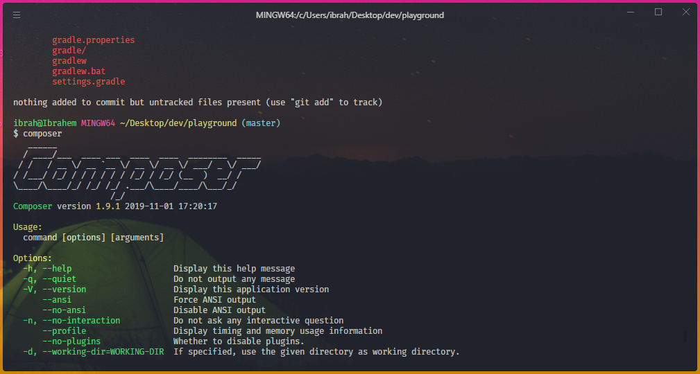

# hyper-preferences

A slick Theme for [hyper](https://hyper.is/) terminal

### Installation

> 1. Place the script in **hyper.js** file

    -The file location is in the installation directory(ex.``UserHome\AppData\Roaming\Hyper`` for windows)

> 2. Update the plugins by running `npm i` inside **hyper.js** directory:
> 3. Start hyper and do a full reload from the app edit menu:

> _Rainbow theme_
>  > _Red gray theme_
> 
